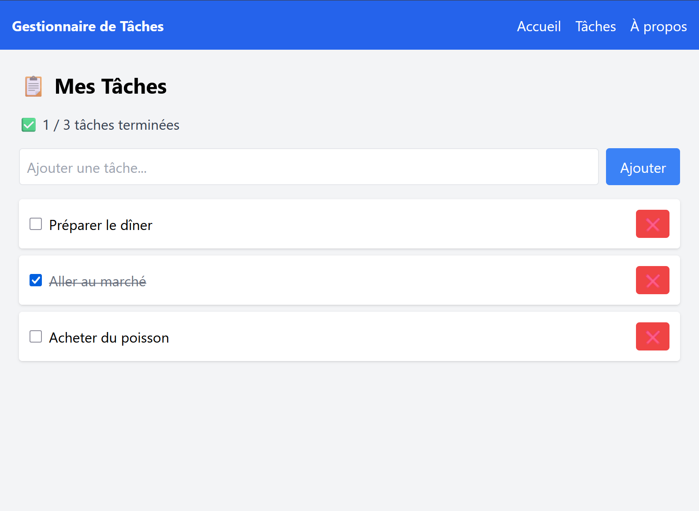

<<<<<<< HEAD
# ✅ Gestionnaire de Tâches (Projet React)

Un projet final développé en **React** permettant de gérer ses tâches quotidiennes :  
ajouter, supprimer, marquer comme terminée et sauvegarder grâce au `localStorage`.
C'est une application React complète pour gérer vos tâches quotidiennes. Ce projet met en pratique les concepts fondamentaux de React, l’optimisation, le routing, le style avec Tailwind CSS, les tests automatisés et le déploiement.

---

## 🚀 Démo en ligne
👉 [Voir l'application ici](⚡ mettre l’URL de Vercel ou Netlify)

---

## 📌 Fonctionnalités
- ➕ Ajouter une nouvelle tâche
- ❌ Supprimer une tâche
- ✅ Marquer une tâche comme faite / non faite
- 💾 Sauvegarde automatique des tâches dans `localStorage`
- 🔀 Navigation entre plusieurs pages avec **React Router**
- 🎨 Interface stylisée avec **Tailwind CSS**
- ⚡ Optimisation des composants avec `React.memo`, `useCallback`, `useMemo`
- [Tests] unitaires/fonctionnels avec Jest et React Testing Library

---

## 🛠️ Technologies utilisées
- [React 19](https://react.dev/)
- [React Router](https://reactrouter.com/)
- [Tailwind CSS](https://tailwindcss.com/)
- [Jest + React Testing Library](https://testing-library.com/) pour les tests
- [Vercel](https://vercel.com/) pour le déploiement


---

## 📂 Structure du projet

gestionnaire-taches/
│── public/
│── src/
│ ├── components/ # Composants réutilisables
│ ├── pages/ # Pages (Accueil, Tâches, À propos)
│ ├── utils/ # Fonctions utilitaires (localStorage)
| ├── assets   
│ ├── App.jsx # Point d’entrée principal
│ └── main.jsx # Fichier racine
│── __tests__/ # Tests Jest
│── package.json
│── README.md

components : Composants réutilisables (BarreNavigation, ListeTaches, TacheItem, PiedDePage)
pages : Pages principales (Accueil, Tâches, À propos)
stockage.js : Gestion du localStorage
__tests__ : Tests unitaires/fonctionnels

📸 Captures d’écran


---

## ⚙️ Installation et lancement

### 1. Cloner le projet
```bash
git clone ⚡ ton-lien-github
cd gestionnaire-taches

Installation et utilisation
# Cloner le repo
git clone https://github.com/votre-utilisateur/gestionnaire-taches.git
cd gestionnaire-taches

# Installer les dépendances
npm install

# Lancer le serveur de développement
npm run dev

# Lancer les tests
npm test


Déploiement
L’application peut être déployée facilement sur Vercel, Netlify ou GitHub Pages. Voir la documentation de chaque service pour plus de détails.

Note technique
Optimisations réalisées
React.memo : Utilisé sur les composants qui n’ont pas besoin de rerendre à chaque changement (ex : TacheItem).
useCallback : Utilisé pour mémoriser les callbacks et éviter les rerendus inutiles des enfants.
useMemo : Utilisé pour calculer le nombre de tâches terminées uniquement quand la liste change.
Découpage en composants : Chaque fonctionnalité est isolée dans un composant réutilisable.

Tests
3 tests unitaires/fonctionnels sont présents dans Taches.test.jsx.
Les tests vérifient l’ajout, la suppression et le changement d’état d’une tâche.
Utilisation de Jest et React Testing Library pour simuler les interactions utilisateur.

Choix techniques
React Router pour la navigation multi-pages.
Tailwind CSS pour un style rapide et responsive.
Vite pour un développement rapide et un build optimisé.
localStorage pour la persistance des données côté client.

✅ Tests réalisés

Nous avons écrit 3 tests principaux avec Jest + React Testing Library :

Ajout d’une tâche → vérifier qu’elle apparaît dans la liste

Suppression d’une tâche → vérifier qu’elle disparaît

Toggle (terminée / non terminée) → vérifier que le style line-through est appliqué


👨‍💻 Auteur

Projet réalisé par ⚡ [Sow Algassimou]
Dans le cadre du cours React JS – Projet Final (2025) par Simplon Guinée


=======
# projetFinalReact
Gestion des tâches
>>>>>>> e7d77629455e28951625336164715c7d97b7b827
